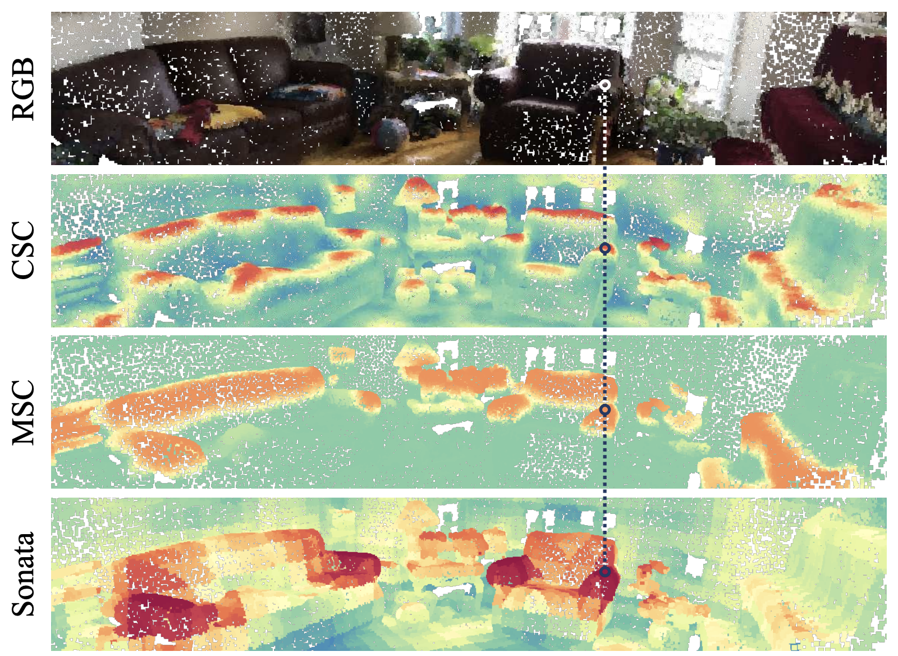
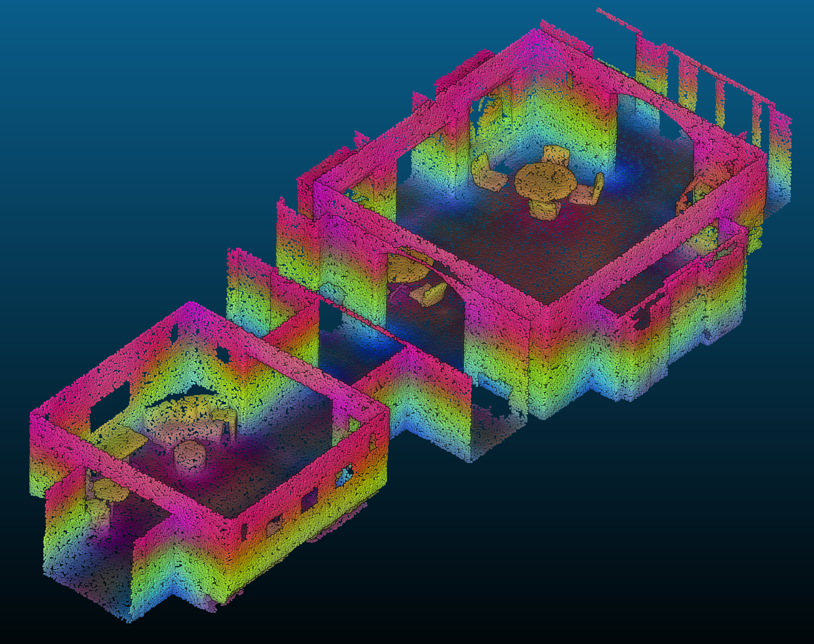

# Critical Analysis of SONATA (CVPR 2025)

Ifrah Ruben

---

Final project for the course *Nuages de Points et Modélisation 3D* at Master 2 IASD, Dauphine-PSL.



## Overview

3D self-supervised learning (SSL) often suffers from the **Geometric Shortcut**, where networks heavily encode low-level spatial coordinates (like absolute $Z$-height) rather than learning high-level abstract semantics. 

The recent architecture [Sonata (CVPR 2025)](https://arxiv.org/pdf/2503.16429) proposes to reduce this issue using a decoder-free self-distillation approach.

This repository contains the codebase and the final report for a focused empirical evaluation of Sonata's claims. By designing a custom linear probing and correlation pipeline, we tested whether absolute spatial coordinates could still be linearly recovered from the model's final **dense, up-casted features**.

## Methodology & Key Findings

We evaluated the pre-trained Sonata backbone on point-level representations extracted from an unseen indoor scan (`indoor_scan.ply`), checking for geometric leakage.



*Zero-shot 6-component PCA visualization of Sonata's dense features on the indoor scan. The continuous color gradient reveals distributed spatial dependence rather than pure discrete semantic clustering.*

1. **Strong Spatial Predictability:** The linear probe was able to almost perfectly reconstruct absolute spatial $(x, y, z)$ coordinates from the $1088$-dimensional dense feature space ($R^2 = 0.988$).
2. **Distributed Leakage:** While no single feature dimension acted as a direct proxy for physical space (mean absolute Spearman $\rho \approx 0.223$), the linear combination of the feature ensemble proved that geometric information was obfuscated across dimensions rather than organically eliminated.

Our findings suggest a potential architectural tension: while latent coarse features may be highly semantic, the parameter-free **feature up-casting** required for dense 3D tasks may preserve or reintroduce substantial low-level spatial information.

## Repository Structure

- `report/`: The final LaTeX report (`report.tex`) detailing the metrics, synthetic control validation, and the real-scene case study results.
- `experiments/axis1/`: The Python scripts used to run the feature extraction and the geometric shortcut testing.
- `scripts/`: Bash scripts to reliably launch evaluations on the high-performance computing cluster (MesoNET / Juliet).
- `sonata-article/`: The upstream official Sonata codebase, required for initializing the pre-trained model.

## Reproducibility and Usage

The evaluation pipeline is built to run on the MesoNET cluster but can be executed locally if the `sonata-article` dependencies are met.

### 1. Synthetic Sanity Check
Validate the linear probing metrics on a generated, synthetic dataset (comparing a forced shortcut vs. a semantic-like representation):
```bash
bash scripts/run_shortcut_test.sh
```

### 2. Real-Scene Feature Extraction
Extract the dense representations from the Sonata 108M-parameter backbone on an indoor scan:
```bash
bash scripts/run_extract_scannet_features.sh
```

### 3. Geometric Shortcut Evaluation
Evaluate coordinate predictability on the extracted feature payloads:
```bash
MODE=npz INPUT_GLOB='results/features/*.npz' bash scripts/run_shortcut_test.sh
```
